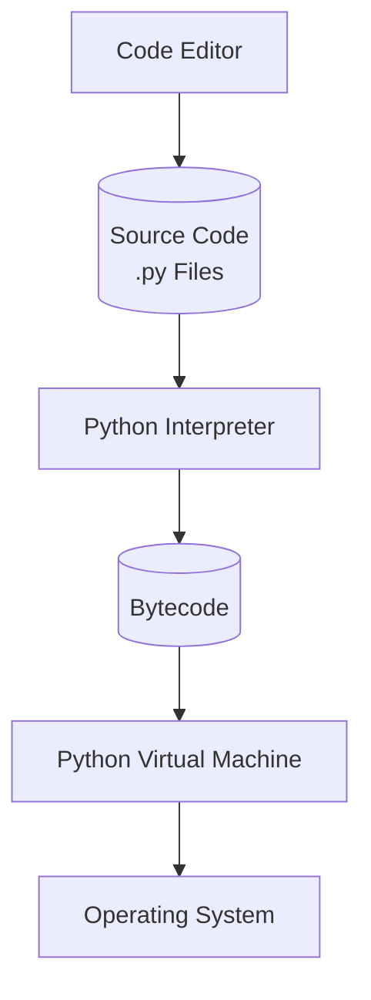

## Procedure

**Step 1:** The programmer uses a text editor or IDE (Visual Code) to write and edit the source code. The code is then saved in a file with a `.py` extension.

**Step 2:** The Python interpreter compiles the source code into **bytecode**, an intermediate form of code that can be executed by the Python runtime.

**Step 3:** The **Python Virtual Machine (PVM)** interprets the bytecode and translates it into instructions that can interact with the computer's operating system and hardware.

