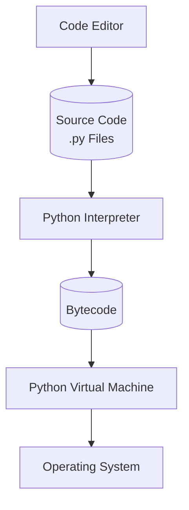

## Procedure

**Step 1:** The programmer uses a text editor or IDE (Visual Code) to write and edit the source code. The code is then saved in a file with a `.py` extension.

**Step 2:** The Python interpreter compiles the source code into **bytecode**, an intermediate form of code that can be executed by the Python runtime.

**Step 3:** The **Python Virtual Machine (PVM)** interprets the bytecode and translates it into instructions that can interact with the computer's operating system and hardware.

## Definitions
- **Systems software**: Software needed to run applications, including the operating system.
- **Application software**: Programs/apps available for users to run.
- **Computer basics**: A computer has a **CPU** (processor) and **RAM** (main memory).
- **RAM**: Temporary storage; data is lost when an application ends.
- **Disk storage**: Permanent storage that keeps data after an application ends.
- **Storage units**: Memory and storage are commonly measured in **MB** and **GB**. A **byte** is roughly equal to one character of data.
